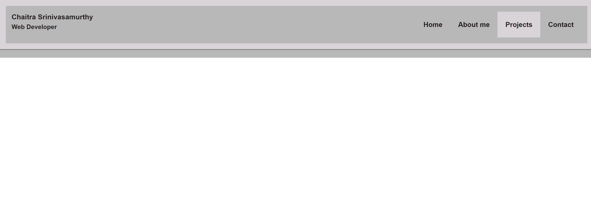

# HW02-Portfolio
# Overview
In  this week's assignment I have tried to build a portfolio page using HTML and advanced CSS. The page contains basic information about me including my name, skills and contact information. I have included images for projects to showcase my work. The navigation bar at the top of the page has links to different sections of the page. On click these links will take the user to the relevant section. The projects section has images which scale when clicked and also take the user to a deplayed demo project which at this stage is just a static page. I have used flexbox and media queries to make the page responsive. I have used CSS variables where possible and commented and the code where appropriate.

Screen shots:
1. 
2. 
3. 
4. 
5. 

1. ![Deployed application]: https://chaitra-srinivas.github.io/HW02-Portfolio/
2. ![Github link]: https://github.com/chaitra-srinivas/HW02-Portfolio
